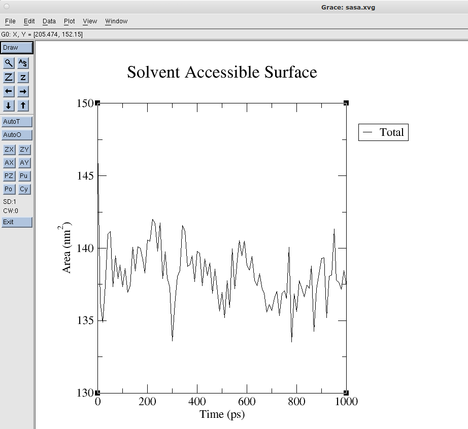

# MD-workshop
# Preparation of the systems
1. Download pdb Structure (PDB ID:3F8F) from RCSB website. https://www.rcsb.org/ 
1. Visualise protein structure using VMD.
```bash
module load vmd
vglrun vmd 3F8F.pdb
```
2. Open the PDB using a text editor like vi, nano, pluma, etc.
```bash
pluma 3F8F.pdb
```
4. Delete waters and hetero groups.
```bash
grep -v HOH 3F8F.pdb > 3F8F_dry.pdb
grep ATOM 3F8F_dry.pdb > 3F8F_dry_clean.pdb
```
5. Load Amber and run tleap to create dry and solvated systems
```bash
module load amber/intel-2020.4/20.0
source $AMBERHOME/amber.sh
tleap -s -f tleap.in > tleap.out
```
6. Read tleap.out file, and also check if prmtop and inpcrd files are created.
```bash
pluma tleap.out
```
7. Load VMD module to visualise solvated protein structure
```bash
vglrun vmd 3F8F_solv_tleap.pdb
```
8. Load Python
```bash
module load anaconda/python-3.8.8/2021.05 
```
9. Open Python and use parmed to convert prmtop and inpcrd files to gromacs topology and structure files (.gro and .top files)
```bash
python3
```
```python
import parmed as pmd
parm=pmd.load_file('3F8F_solv_tleap.prmtop', '3F8F_solv_tleap.inpcrd')
parm.save('3F8F_gromacs.top', format='gromacs')
parm.save('3F8F_gromacs.gro')
quit()
```
10. We need position restrain files for equilibration step. First we need to separate two chains into two text files using pluma etc. (chaina.pdb and chainb.pdb). 
11. Load gromacs module and create posre files using gromacs command. Only heavy atoms are restrained during equilibration step. (Select Protein-H)
```bash
module load gromacs/intel-2022.2/2022.1-single
gmx_mpi genrestr -f chaina.pdb -o posre-a.itp
gmx_mpi genrestr -f chainb.pdb -o posre-b.itp
```
12. Position restrain files are needed to included in 3F8F_gromacs.top topology file. Two systems (chain a and chain b) and solvent are defined in the topology file(as seen at the end of 3F8F_gromacs.top file). At the end of each of system, starting with [moleculetype], add the below comment for both system.
```scala
; Include Position restraint file
#ifdef POSRES
#include "posre-a.itp"
#endif
```
```scala
; Include Position restraint file
#ifdef POSRES
#include "posre-b.itp"
#endif
```
13. Position restrain on the oxygen atom of water molecules needs to be added into the related part. (At the end of water defined part in topology file)
```scala
>>>>>>> 7537cfd303ad0e73ab3b611bac13cc73a4fbd997
#ifdef POSRES_WATER
; Position restraint for each water oxygen
[ position_restraints ]
;  i funct       fcx        fcy        fcz
   1    1       1000       1000       1000
#endif
```
# Run MD
1. Before running Md, control all files with .sh extension, and correct account id part.
```bash
sbatch gromacs-all-md.sh
```
This will look different if you are using the teaching nodes or the standard nodes:
### Teaching

```bash
#!/bin/bash
# Propogate environment variables to the compute node
#SBATCH --export=ALL
# Run in the teaching partition (queue)
#SBATCH --partition=teaching
# Specify project account
#SBATCH --account=tuttle-rmss
# No. of tasks required (max of 16), all cores on the same node
#SBATCH --ntasks=1 --cpus-per-task=16
# Specify (hard) runtime (HH:MM:SS)
#SBATCH --time=20:00:00
# Job name
#SBATCH --job-name=md-workshop
# Output file
#SBATCH --output=slurm-%j.out
#======================================================
module purge
export OMP_NUM_THREADS=1
module load gromacs/intel-2022.2/2022.1-single
#======================================================
# Prologue script to record job details
# Do not change the line below
#======================================================
/opt/software/scripts/job_prologue.sh
#------------------------------------------------------
# Energy minimization (no mpirun, specific mpi cores with "-ntmpi")
gmx_mpi grompp -f min.mdp -c 3F8F_gromacs.gro -p 3F8F_gromacs.top -o em.tpr
gmx_mpi mdrun -ntmpi 10 -deffnm em
...
```

### Standard
```bash
#!/bin/bash
# Propogate environment variables to the compute node
#SBATCH --export=ALL
# Run in the standard partition (queue)
#SBATCH --partition=standard
# Specify project account
#SBATCH --account=account-id
# No. of tasks required (max of 40), all cores on the same node
#SBATCH --ntasks=40 --nodes=1
# Specify (hard) runtime (HH:MM:SS)
#SBATCH --time=06:00:00
# Job name
#SBATCH --job-name=md-workshop
# Output file
#SBATCH --output=slurm-%j.out
#======================================================

module purge
export OMP_NUM_THREADS=1
module load gromacs/intel-2022.2/2022.1-single
#======================================================
# Prologue script to record job details
# Do not change the line below
#======================================================
/opt/software/scripts/job_prologue.sh
#------------------------------------------------------

# Energy minimization (using mpirun to assign cores)
mpirun -np $SLURM_NTASKS gmx_mpi grompp -f min.mdp -c 3F8F_gromacs.gro -p 3F8F_gromacs.top -o em.tpr

mpirun -np $SLURM_NTASKS gmx_mpi mdrun -deffnm em
```


# Analysis
1. RMSD analysis (select Protein/1 both times)
```bash
gmx_mpi rms -s md_1ns.tpr -f md_1ns.xtc -o rmsd.xvg -tu ns
```
2. Solvent Accesible Surface Area Analysis (SASA) (select Protein/1)
```bash
gmx_mpi sasa -f md_1ns.xtc -s md_1ns.tpr -o sasa.xvg
```


You can visualise these analyses using 
```bash
xmgrace sasa.xvg
```


